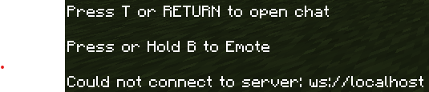

# Tiktok-Chat-Minecraft-Connector
## What is TikTok Chat Minecraft Connector
TikTok Chat Minecraft Connector is a tool that links your TikTok live chat with your Minecraft server.  
It lets messages from TikTok appear in Minecraft.

This code for MCBE(MineCraft Bedrock Edition)
## How to Connect
Open your Minecraft chat and enter:
``/connect localhost``

## Troubleshooting Connection
If it doesn't work as shown in the image below, try the following steps:

1. Check that you typed ``/connect localhost`` correctly.
2. Open **Command Prompt** as administrator and type ``CheckNetIsolation LoopbackExempt -a -n="Microsoft.MinecraftUWP_8wekyb3d8bbwe"``
If it still doesn't work, please add ``MinedPlumr`` on Discord and contact me
